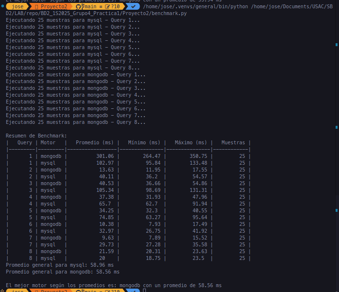
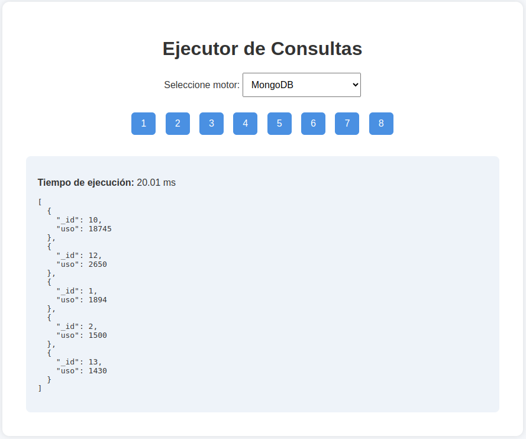

# Proyecto 2 - Comparación entre MySQL y MongoDB

## Universidad de San Carlos de Guatemala

**Facultad de Ingeniería**

**Escuela de Ciencias y Sistemas**

**Curso: Sistemas de Bases de Datos 2 – 1er Semestre 2025**

**Docente: Ing. Otto Amílcar Rodríguez Acosta**

**Auxiliar: Emiliano José Alexander Velásquez Najera**

Repositorio del proyecto:
[https://github.com/Jhonsagui81/BD2_1S2025_Grupo4_Practica1.git](https://github.com/Jhonsagui81/BD2_1S2025_Grupo4_Practica1.git)

---

## Modelado de Bases de Datos

### Modelo Relacional (MySQL)

El modelo relacional se estructuró mediante la normalización de las siguientes entidades principales:

- **Pacientes** (`idPaciente`, `nombre`, `edad`, `genero`, etc.)
- **Habitaciones** (`idHabitacion`, `habitacion`)
- **LogHabitaciones** (`idLog`, `idHabitacion`, `timestamp`, `status`)
- **LogActividades** (`idLog`, `timestamp`, `actividad`, `idHabitacion`, `idPaciente`)

Este modelo permite relaciones directas mediante llaves foráneas, lo cual garantiza integridad referencial, facilita consultas complejas (JOINs) y permite la optimización mediante índices.

### Modelo NoSQL (MongoDB)

El modelo NoSQL fue diseñado en formato flexible, manteniendo una estructura similar:

```json
{
  "Pacientes": {
    "idPaciente": "int",
    "edad": "int",
    "genero": "string"
  },
  "Habitaciones": {
    "idHabitacion": "int",
    "habitacion": "string"
  },
  "LogHabitacion": {
    "idHabitacion": "int",
    "timestamp": "datetime",
    "status": "string"
  },
  "LogActividades1": {
    "timestamp": "datetime",
    "actividad": "string",
    "idHabitacion": "int",
    "idPaciente": "int"
  },
  "LogActividades2": {
    "timestamp": "datetime",
    "actividad": "string",
    "idHabitacion": "int",
    "idPaciente": "int"
  }
}
```

MongoDB permite un almacenamiento flexible de documentos sin relaciones rígidas, lo cual favorece rendimiento en ciertos escenarios de lectura simple pero puede requerir replicación o agregaciones complejas para lograr equivalencia semántica con relaciones SQL.

---

## Resultados del Benchmark

| Query | Motor   | Promedio (ms) | Mínimo (ms) | Máximo (ms) | Muestras |
| ----- | ------- | ------------- | ----------- | ----------- | -------- |
| 1     | mongodb | 301.06        | 264.47      | 350.75      | 25       |
| 1     | mysql   | 102.97        | 95.84       | 133.48      | 25       |
| 2     | mongodb | 13.63         | 11.95       | 17.55       | 25       |
| 2     | mysql   | 40.11         | 36.20       | 54.57       | 25       |
| 3     | mongodb | 40.53         | 36.66       | 54.86       | 25       |
| 3     | mysql   | 105.34        | 98.69       | 131.31      | 25       |
| 4     | mongodb | 37.38         | 31.93       | 47.96       | 25       |
| 4     | mysql   | 65.70         | 62.70       | 91.94       | 25       |
| 5     | mongodb | 34.25         | 32.30       | 40.55       | 25       |
| 5     | mysql   | 74.85         | 63.27       | 95.64       | 25       |
| 6     | mongodb | 10.38         | 7.93        | 17.49       | 25       |
| 6     | mysql   | 32.97         | 26.75       | 41.92       | 25       |
| 7     | mongodb | 9.63          | 7.89        | 15.52       | 25       |
| 7     | mysql   | 29.73         | 27.28       | 35.58       | 25       |
| 8     | mongodb | 21.59         | 20.31       | 23.63       | 25       |
| 8     | mysql   | 20.00         | 18.75       | 23.50       | 25       |

> **Mejor motor promedio:** MongoDB con 58.56 ms.


_Figura 1. Resultado del benchmark ejecutado desde consola Python._


_Figura 2. Resultado de consulta en MySQL desde la API._


_Figura 3. Resultado de consulta en MongoDB desde la API._

---

## Conclusión

Aunque los resultados del benchmark indican que **MongoDB presenta tiempos promedio menores en la mayoría de consultas**, esta ventaja se debe principalmente a la estructura sin validación relacional, lo que reduce el costo computacional de operaciones tipo JOIN.

Sin embargo, **las bases de datos relacionales como MySQL siguen siendo preferibles en sistemas clínicos y similares** por las siguientes razones:

1. **Integridad referencial:** Permiten relaciones claras entre entidades como pacientes, actividades y habitaciones.
2. **Validación estricta:** Los esquemas SQL aseguran consistencia estructural.
3. **Soporte transaccional:** Ideal para sistemas donde se requiere ACID completo.
4. **Escalabilidad lógica:** El diseño normalizado facilita mantenimiento y evolución del sistema.

MongoDB es adecuado en entornos altamente distribuidos o con requerimientos de escritura intensiva y estructuras heterogéneas, pero no sustituye la robustez estructural de los modelos relacionales en aplicaciones críticas como clínicas.

**Justificación final:**

Con base en el análisis técnico, se concluye que **no es recomendable realizar una migración completa hacia MongoDB en este caso particular**, dado que las operaciones de la clínica se benefician significativamente del control relacional, la consistencia de datos y la integridad referencial que ofrece MySQL. Aunque MongoDB podría complementar ciertos módulos de registro de eventos o bitácoras con alta concurrencia, el núcleo de la operación clínica exige la estabilidad y estructura formal que solo una base de datos relacional puede garantizar de forma confiable.

---

## API REST

Se implementó una API REST con rutas del tipo:

```
GET /query/{engine}/{query_id}
```

Donde:

- `{engine}` puede ser `mysql` o `mongodb`
- `{query_id}` corresponde a una de las 8 consultas solicitadas

Los resultados se entregan en formato JSON con los campos `result` y `time_ms`.

### Comando para ejecutar el backend:

```bash
uvicorn server:app --reload
```

El código completo se encuentra en el repositorio indicado.
